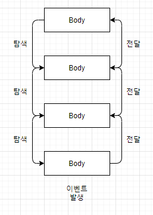

## Event Propagation(Event Bubbling)

**특정 화면 요소(Elements)에서 이벤트가 발생했을 때 해당 이벤트가 더 상/하 위의 화면 요소들로 전파되어 가는 특성** 

**IE8 포함 이전: outer-div > inner-div > header > text**

**standard others : outer-div < inner-div < header < text** 


### **1. 이벤트 등록**

- addEventListener 메서드 사용하여 특정 요소에 이벤트 등록

```javascript
<button id=“btn”>클릭</button>

<script>
    const button = document.getElementById('btn');
    button.addEventListener('click', onClick);

    function onClick (event) {
        // Click function
    }
</script>
```

 

### **2. 브라우저의 이벤트 감지**

#### **1) 이벤트 버블링(Event Bubbling)**

- 특정 요소에서 이벤트 발생 시, 해당 이벤트가 상위 요소들로 이벤트 전달(자식 -> 부모)
- 하위에서 상위 요소로 이벤트 전파 방식을 이벤트 버블링(Event Bubbling)





예제)

```javascript
<body>
    <div class="div1">
        <div class="div2">
            <div class="div3">
            </div>
        </div>
    </div>
</body>


const divs = document.querySelectorAll('div')
divs.forEach((div) => {
    div.addEventListener('click', (evnet) => {
        console.log(event.currentTarget.className + " click");
    });
});


-- 출력 결과(div3 클릭) --
div3 click
div2 click
div1 click
```

 

설명)

- 세 개의 div 태그에 모두 클릭 이벤트 등록
- class div3의 div 클릭 시 하나의 로그만 출력을 기대했지만, 브라우저가 이벤트를 감지하는 방식으로 인해, 3개의 이벤트가 출력
- 특정 요소(자식)에서 이벤트 발생 시, 그 이벤트를 최상위 요소(부모)까지 이벤트를 전파
- div3 -> div2 -> div1 (세번째 div 클릭 시)
- div2 -> div1 (두번째 div 클릭 시)
- 이벤트가 등록되어 있어야지만 위와 같은 현상 발생
- 하위에서 상위 요소로 이벤트 전파 방식을 이벤트 버블링(Event Bubbling) 이라고 함

 

#### **2) 이벤트 캡처(Event Capture)**

- 이벤트 버블링과 반대 방향으로 이벤트를 전파하는 방식
- 특정 이벤트 발생 시, 최상위 요소에서 이벤트를 전달 받은 후, 해당 태그를 찾아 내려가는 방식


예제)

```javascript
<body>
    <div class="div1">
        <div class="div2">
            <div class="div3">
            </div>
        </div>
    </div>
</body>


const divs = document.querySelectorAll('div');
divs.forEach((div) => {
    div.addEventListener('click', (evnet) => {
        console.log(event.currentTarget.className + " click");
    }, true);
});


-- 출력 결과(div3 클릭) --
div1 click
div2 click
div3 click
```

 

설명)

- EventTarget.addEventListener() 메서드 useCapture 옵션 true 지정(캡처 여부 지정, default는 false)
  MDN 문서 target.addEventListener(type, listener[, useCapture]); 
- 이벤트 버블링(Event Bubbling) 과 반대 방향으로 탐색

 

 

**※ event.stopPropagation()**

- 현재 이벤트 이후의 전파를 방지
- 이벤트 버블링의 경우, 클릭한 요소의 이벤트만 발생시키고 상위 요소로 이벤트 전달을 방지
- 이벤트 갭처의 경우, 클릭한 요소의 최상위 요소의 이벤트만 동작시키고 하위 요소들에게 이벤트 전달 방지

 

예제) Event Bubbling

```javascript
<body>
    <div class="div1">
        <div class="div2">
            <div class="div3">
            </div>
        </div>
    </div>
</body>


const divs = document.querySelectorAll('div');
divs.forEach((div) => {
    div.addEventListener('click', (evnet) => {
       event.stopPropagation();
       console.log(event.currentTarget.className + " click");
    });
});


-- 출력 결과(div3 클릭) --
div3 click
```

 

예제) Event Capture

```javascript
<body>
    <div class="div1">
        <div class="div2">
            <div class="div3">
            </div>
        </div>
    </div>
</body>


const divs = document.querySelectorAll('div');
divs.forEach((div) => {
    div.addEventListener('click', (evnet) => {
       event.stopPropagation();
       console.log(event.currentTarget.className + " click");
    }, true);
});


-- 출력 결과(div3, div2, div1 클릭) --
div1 click
```

 

 

#### **3) 이벤트 위임(Event Delegation)**

- 하위 요소에 각각 이벤트를 붙이지 않고 상위 요소에서 하위 요소의 이벤트들을 제어하는 방식
- 이벤트 핸들링 패턴의 일종

 

**예제)**

```javascript
<body>
    <button onclick="clickBtn()">클릭</button>
    <ul class='itemList'>
        <li>
            <div></div>
        </li>
        <li>
            <div></div>
        </li>
    </ul>
</body>


<script>
    const divs = document.querySelectorAll('div');
    divs.forEach((div) => {
        div.addEventListener('click', (evnet) => {
            console.log('click')
        });
    });

    function clickBtn() {
        const li = document.createElement('li');
        const div = document.createElement('div');
        li.appendChild(div);


        document.querySelector('.itemList').appendChild(li);
    }
</script>
```

 

설명

- div 태그 클릭 시 이벤트 등록
- 버튼 클릭 시, 동적 li, div 태그 추가
- 동적으로 추가한 경우, 이벤트 등록의 추가적인 작업 필요
- 이전 2개의 div에는 이벤트를 등록하였지만, 이후 시점에 동적으로 태그를 추가하였기 때문에, 추가적인 작업 필요
- 이벤트 리스너를 등록하는 작업이 번거로움

 

예제)

```javascript
<body>
    <button onclick="clickBtn()">클릭</button>
    <ul class='itemList'>
        <li>
            <div></div>
        </li>
        <li>
            <div></div>
        </li>
    </ul>
</body>


<script>
    const itemList = document.querySelector('.itemList');
    itemList.addEventListener('click', (evnet) => {
        console.log('click')
    });
    
    function clickBtn() {
        const li = document.createElement('li');
        const div = document.createElement('div');
        li.appendChild(div);

        document.querySelector('.itemList').appendChild(li);
    }
</script>
```


설명

- div 태그에 이벤트를 등록하는 대신, 상위 요소인 ul 태그에 이벤트 등록
- 하위에서 발생한 이벤트를 이벤트 버블링을 통해 상위 요소인 ul 에서 감지
- 특정 엘리먼트 하나하나 이벤트를 등록하지 않고 부모에 이벤트를 등록하여 부모에게 이벤트를 위임하는 방법

 

**이벤트 위임의 장점**

- 상위 엘리먼트에서만 이벤트 리스너를 관리하기 때문에, 하위 엘리먼트의 자유로운 추가/삭제
- 쉬운 이벤트 핸들러 관리
- 메모리 사용량/누수 가능성 감소
  특정 엘리먼트 하나하나 이벤트를 등록하는 경우, 엘리먼트 삭제 시 이벤트 리스너를 제거해야 누수 방지