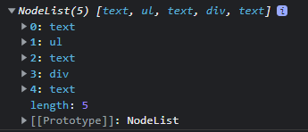
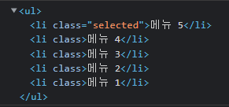
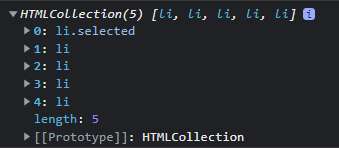

## 자바스크립트


#### 개요

- 네스케이프의 라이브 커넥트 라는 서버측 기술에서 연동이 필요한 클라리언트측의 스크립트 언어였던 라이브스크립트에서 부터 시작
- 처음에는 모카(Mocha)라는 이름으로 개발되었으나, 그 후에 라이브스크립트(LiveScript), 최종적으로는 자바스크립트(JavaScript)라는 이름으로 변경됨


#### 특징

1. 자바스크립트는 객체 기반의 스크립트 언어이다.

2. 자바스크립트는 동적이며, 타입을 명시할 필요가 없는 인터프리터 언어이다.(한줄씩 해석하여 명령어를 실행)

3. 자바스크립트는 객체 지향형 프로그래밍과 함수형 프로그래밍을 모두 표현할 수 있다.


|                자바                 |                자바스크립트                 |
| :---------------------------------: | :-----------------------------------------: |
|             컴파일 언어             |               인터프리터 언어               |
|      타입 검사를 엄격하게 함.       |            타입을 명시하지 않음.            |
| 클래스(class) 기반의 객체 지향 언어 | 프로토타입(prototype) 기반의 객체 지향 언어 |


### 왜 JavaScript를 사용하는가?

- HTML 문서 조작
  - HTML문서에 대한 조작(태그,속성,스타일)을 통해서 데이터를 얻어온다.
- 유효성 검사
  - 서버에게 데이터를 보내기 전에 검사


## 변수

- 타입을 명시하지 않고, `var` 키워드를 사용하여 선언한다.
- var 키워드 입력하지 않으면, 반드시 전역변수가 된다.
- 할당되는 과정에서 자동으로 변수의 타입 결정 -> 같은 변수에 여러 타입의 값 할당 가능

| 키워드      | 구분 | 선언위치    | 재선언 |
| :---------- | :--- | :---------- | :----- |
| var         | 변수 | 전역 스코프 | 가능   |
| let (ES6)   | 변수 | 해당 스코프 | 불가능 |
| const (ES6) | 상수 | 해당 스코프 | 불가능 |


## 자료형

| 자료형    | typeof 출력값 | 설명                                         |
| :-------- | :------------ | :------------------------------------------- |
| 숫자형    | number        | 정수, 실수                                   |
| 문자열형  | string        | 문자 ’, ” 으로 표기                          |
| boolean형 | boolean       | 참, 거짓                                     |
| undefined | undefined     | 변수가 선언 되었지만 초기화가 되지 않을 경우 |
| null      | object        | 값이 존재하지 않을 경우                      |

- 숫자를 정수와 실수로 나누어 구분하지 않는다.

- 0으로 나누는 연산에 대해 예외를 발생 시키지 않는다.

- 특별한 상수가 존재한다.

  - Infinity : 무한대, 어떤 수를 0으로 나누거나 Infinity를 어떠한 수로 연산할 때 발생
  - NaN(Not a Number) : 계산 결과가 숫자가 아님을 나냄

  ```javascript
  console.log(100 / 0) // Infinity
  console.log(new Number('1A')) // NaN
  ```


### 문자열 표현

- ’ , ” 둘 다 사용 가능.
- 백틱(`)을 사용하면, 줄바꿈 표현 가능.
- 백틱(`)은 **${ 변수명 }** 으로 사용 가능

```javascript
var a = "홍길동";
var b = '홍길동';
var c = `홍 길
동`;
var str = `홍 길 동`;

console.log(`이름은 ${str} 입니다`);
console.log(a);
console.log(b);
console.log(c);
이름은 홍 길 동 입니다
홍길동
홍길동
홍 길
동
```


### 문자열 비교

**1.자바**

```java
"java".equals("JAVA")   ==> (O) 문자열 내용 비교
"java" == "JAVA"        ==> (O) 메모리 주소 비교
```

**2.자바스크립트**

```javascript
"javascript".equals("JAVASCRIPT") ==> (X) 에러발생         
"javascript" == "JAVASCRIPT"      ==> (O) 문자열 내용 비교
```

**”==”와 ”===” 차이점**

- == : 내용만 같다면 자동 true를 반환. 자료형이 다를 경우 형변환 후 비교
- === : 자료형, 내용 모두 같아야만 true를 반환.

```javascript
var a = 100;
var b = '100';

if (a==b) {
    console.log(a + "==" + b);
}

if (a===b) {
    console.log(a + "===" + b);
} else {
    console.log(a + "!==" + b);
}
100==100
100!==100
```


## 개행 처리하기

```javascript
var str = "줄바꿈 \n 테스트 중...";
var str2 = "줄바꿈 <br> 테스트 중...";
document.write(str);
document.write(str2);
줄바꿈 테스트 중...줄바꿈
테스트 중...
```

자바스크립트는 `<br>`태그를 사용하여 개행 처리를 한다.


## 호이스팅

**변수 끌어올림**

소스코드가 실행되기 전, 변수 선언은 미리 이루어진다.

특히 var 키워드는 런타임 전에 변수를 선언하면서 ‘undefined’가 할당된다.

그래서 **변수를 선언하기 전에! 해당 변수를 참조할수 있게** 된다.

// 이 코드는 오류 없이 실행 된다

```text
console.log(var_01);  // undefined
var var_01; 
```

var_01 이 뒤에서 선언되었는데도!

console.log(var_01)는 잘 실행되어 undefined를 출력한다.

코드실행 런타임 전에 var_01 변수의 선언과 undefined의 할당이 이루어졌기 때문이다.


## 일급객체

- 함수를 변수에 저장할 수 있다.
- 함수의 인자로 함수를 입력할 수 있다.
- 함수의 리턴으로 함수를 리턴할 수 있다.


## 브라우저 렌더링 과정

1. 서버연결 XmlHttpRequest
2. html 가져오기
3. 파싱해서 document 만들기
4. 자바스크립트 실행하기
5. 렌더링하기

반드시 순서대로 실행됨.


## AJAX

브라우저 통신 모듈을 이용하지 않고, 직접 통신하기 위해서 사용


## 변수

> - 변수의 범위 : 자바스크립트는 어휘에서 변수의 범위를 알 수 있는 정적 범위이다(Lexical Scope)


## 변수의 범위(Scope)

1. 자바스크립트는 어휘에서 변수의 범위를 알 수 있는 정적 범위이다.(Lexical Scope)

2. ES6 이전

   자바와 같은 블록 범위를 지원하지 못했다.

   함수 범위(Function Scope)만 지원했다.

   function() {...} 안에서 변수 앞에 var라는 키워드를 사용하면 함수 범위를 가지게 된다.

   만일, var 키워드 없이 함수 안에서 변수를 정의하게 되면 전역 범위를 가지게 된다.

3. ES6 이후

   새롭게 Block Scope이 생겼다.

   let / const

4. const/let 만 사용하고 반드시 붙이자


##  구문(statement)

1. 자바스크립트 실행 단위

2. 구문 구성

   값, 연산자 : 표현식

   주석 : 구문을 구성해도 실행되지 않는다.

   예약어들 : if, const, for, ...

3. 구문의 예

   if, if~else, switch, for, while, do~while, for~in

4. 공백은 무조건 토큰을 분리하는 역할만 함

5. 세미콜론: 원칙적으로 구문을 분리한다.

6. 개행


## 자바스크립트 객체 : object 타입

1. 자바스크립트 객체는 obgect 타입과 function 타입이 있다.

2. 보통, function 타입 객체는 함수라 부른다.

3. 따라서 자바스크립트에서 우리가 흔히 객체라 부르는 것은 object 타입의 객체라 할 수 있다.


## 자바스크립트 객체2 - function type(함수)

1. 일반 함수(실행코드 블록이 있는 함수, 관례대로 소문자로 시작)

2. 생성자 함수(관례대로 대문자로 시작)


## DOM

### 태그 조작

```javascript
// DOM Level 1 Event 처리 : HTML element의 event 속성에 자바스크립트 코드를 사용하는 방법
 // 2) JavaScript Code(DOM API)로만 작성하기
 var onTabClicked = function() {
	 console.log("click!!!" + this.innerText);
	 // unselect
	 var liSelected = document.getElementsByClassName("selected");
	 if(liSelected.length === 1){
		 liSelected[0].className = '';
	 }
	 
	 // select 
	 this.className = "selected";
 }
 
 window.onload = function() {										// 브라우저가 화면이 load 시 수행
	 console.log("DOM loaded!");
	 var divTabBox = document.getElementsByClassName("tab-box")[0];	// 1
	 console.log(divTabBox.childNodes);
	 
     var ul = divTabBox.childNodes[1];								// 2
	 console.log(ul);
	 
	 var liTabs = ul.getElementsByTagName("li");					// 3
	 console.log(liTabs);
    
     for(var i = 0; i< liTabs.length ; i++){						// 4
		 liTabs[i].onclick = onTabClicked;
	 }
 }
</script>
```

1. "tab-box" 클래스 이름에 속한 태그들을 담는 노드를 가져온다



2. 위의 인덱스 1에 해당하는 ul 태그들을 가져온다
    

  

 3. li 태그를 가진 리스트를 가져온다
    

    

4. 각 li태그들을 브라우저에서 클릭하면 onTabClicked 함수가 수행된다


### 표현식

```
 if(liSelected.length === 1){
		 liSelected[0].ClassName = '';
 }
```

위 식은 아래와 같이 바뀔 수 있다.

``` ㅇ
 (liSelected.length === 1) && (liSelected[0].ClassName = '');
```

( 1번식 ) && ( 2번식) 이라 생각하면 && 표현은 1번식이 참이 되어야 2번식을 수행하기 때문에 if 구문과 동일한 로직을 수행한다

하지만 추천하는 방법은 아니지만 많은 코드들이 이렇게 표현되어 있을 수 있기에 알아 두어야 한다

