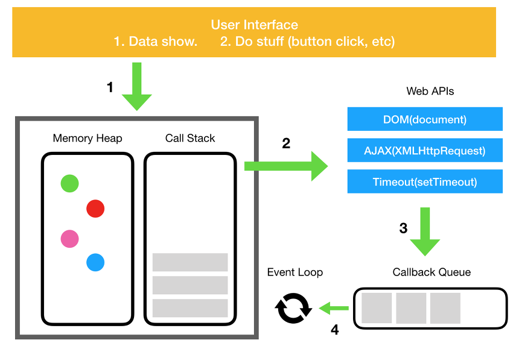

## 자바스크립트 실행 문맥(Call Stack)에 대한 이해

자바스크립트는 함수를 실행하기 위해 스택의 전역코드에서 해당 함수를 실행하기 위한 문맥을 Stack에 push하고, 작업이 끝나거나 return 결과 값을 반환하면 함수를 호출한 부분으로 되돌아오게되면 스택에서 pop하게 된다. 이 과정이 비동기적으로 이루어지는데, 코드를 실행하는 와중에 다른 함수를 호출하면 그 함수의 실행 문맥도 push되게된다. **이러한 이유로 자바스크립트의 실행 문맥을 Call Stack, 즉 호출 스택이라고 부른다.**


## Single Thread, Multi Thread

프로그램을 실행하는 방식에는 크게 두 가지가 있다. 싱글 스레드 방식과 멀티 스레드 방식이다. 스레드는 프로그램에서 순차적인 처리 흐름을 나타내는 것으로 자바스크립트에서는 싱글 스레드 프로그래밍 언어이므로 단일 호출 스택을 가지게 된다. 이 뜻은 한 번에 하나의 일만 처리할 수 있다는 뜻이다. Call Stack에 쌓인 실행문맥을 위에서부터 아래로 차례차례 실행하게된다.


### 단일 호출 스택을 가졌을 때의 문제점, 해결책

- 브라우저가 호출 스택에서 많은 작업을 처리하게 되면 꽤 오랜 시간동안 응답을 멈출 수 있다. 혹은, 하나의 함수 처리가 엄청 느려서 다른 함수 실행에 지장을 줄 수도 있다.

이때 가장 쉬운 해결책은 **비동기 콜백**을 사용하는 것이다.
코드 일부만 실행하고 나중에 실행될 콜백함수를 정해주게 되면, 즉시가 아닌 특수한 시점에 실행되므로 스택 안에 바로 push될 필요가 없게 된다.

### Event Que, 비동기 콜백 처리 과정




## Ajax(Asynchronous JavaScript and XML)

웹 브라우저는 자바스크립트의 `XMLHttpRequest` 객체를 이용해 Ajax 요청을 처리한다. 객체를 이용해 서버에 요청을 전달한 후, 서버로 부터 응답을 받으면 동일한 `XMLHttpRequest` 객체가 전달받은 데이터를 처리하게 된다.


**비동기방식**

: 웹페이지를 리로드하지 않고 데이터를 불러오는 방식

- 비동기식 자바스크립트와 XML
- 자바스크립트를 이용해 서버와 브라우저가 **비동기 방식**으로 데이터를 교환할 수 있는 통신 기능
- XMLHttpRequest 객체를 이용하여 페이지의 일부분만 데이터를 로드하는 기법(불필요한 리소스 낭비를 줄일수 있다.)


**Ajax의 장점**

1. 웹페이지의 속도향상

2. 서버의 처리가 완료 될때까지 기다리지 않고 처리 가능하다.

3. 서버에서 Data만 전송해면 되므로 전체적인 코딩의 양이 줄어든다.

4. 기존 웹에서는 불가능했던 다양한 UI를 가능하게 해준다. 


#### Ajax 진행과정

1. XMLHttpRequest Object를 만든다.
2. callback 함수를 만든다.
3. Open a request
4. send the request


### Ajax 요청하기

```js
// XMLHttpRequest 객체의 인스턴스를 생성합니다.
var xhr = new XMLHttpRequest();

// open() 메서드는 요청을 준비하는 메서드입니다. (http 메서드, 데이터를 받아올 URL 경로, 비동기 여부)
xhr.open("GET", "data/test.json", true);

// send() 메서드는 준비된 요청을 서버로 전송하는 메서드입니다. (서버에 전달될 정보)
xhr.send("search=alice");
```


### Ajax 응답 처리하기 - onload 방식

브라우저가 서버로부터 AJAX 응답을 받으면 onload 이벤트가 발생합니다. XMLHttpRequest 객체는 이벤트에 등록된 함수를 호출하여 데이터를 처리한다.

```js
xhr.onload = function () {
  // xhr 객체의 status 값을 검사한다.
  if (xhr.status === 200) {
    // 서버로 부터 받은 데이터를 처리할 코드
  }
}
```

### Ajax 응답 처리하기 - onreadyStateChange 방식

```js
var btn = document.getElementById('loadData');

btn.addEventListener('click', loadData, false);

function loadData() {
  var xhr = new XMLHttpRequest();
  xhr.onreadyStateChange = function () {
    if (this.readyState === 4 && this.status === 200) {
      document.getElementById('panel').innerHTML = this.responseText;
    }
  };

  xhr.open("GET", "data/test.txt", true);
  xhr.send();
}
```


### Ajax로 데이터 로드하기

```js
var xhr = new XMLHttpRequest();

xhr.onload = function() {
  if (xhr.status === 200) {
    document.getElementById("content").innerHTML = xhr.responseText;
  }
};

xhr.open("GET", "data/data.html", true);
xhr.send(null);
```

