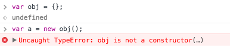
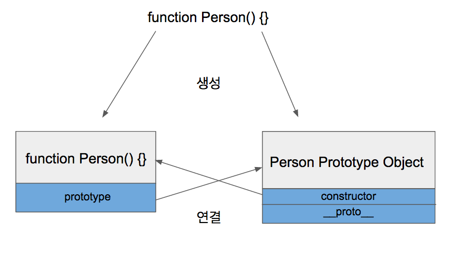
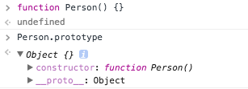
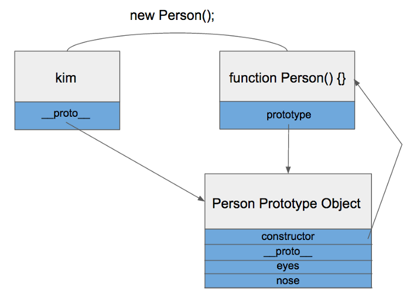
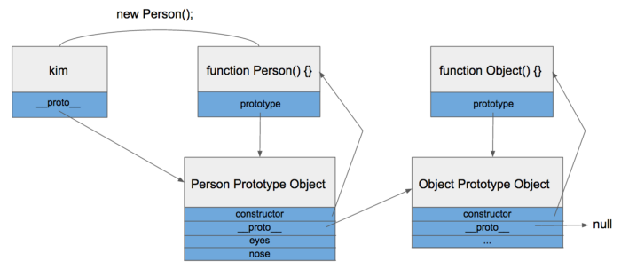
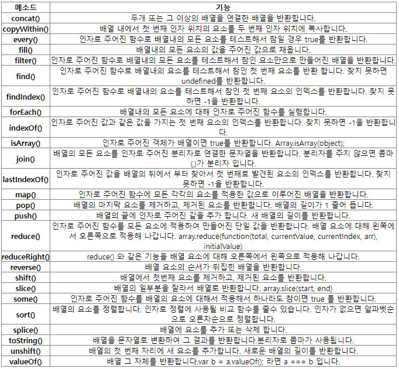

# Prototype

자바스크립트에는 클래스라는 개념이 없다

대신 프로토타입(Prototype)이라는 것이 존재한다

자바스크립트 = 프로토타입 기반 언어

클래스가 없다 ⇒ 상속 기능도 없다

그래서 프로토타입을 기반으로 상속을 흉내내도록 구현하여 사용한다

ECMA6 표준에서는 Class 문법이 추가되었지만 문법이 추가된 것이지 자바스크립트가 클래스 기반으로 바뀐것이 아니다

자바스크립트는 클래스는 없지만 함수(function)와 new를 통해 클래스를 흉내낼 수 있다

자바스크립트에는 `Prototype Link`와 `Prototype Object`라는 것이 존재하며 이 둘을 `Prototype`이라 한다


### Prototype Object

Prototype Object는 자바에서 최상위 객체인 Object라고 생각하면 된다

모든 객체는 Object를 상속하여 쓰듯이 Prototype Object도 비슷하게 생각하면 된다

객체는 언제나 함수(Function)로 생성된다

```java
var obj = {};                 // => 함수
```

위 코드는 아래 코드와 같다

```java
var obj = new Object();     
```

obj 객체를 { } 표현식으로 정의하면 그것은 new로 객체를 생성하게 됨을 의미한다


함수가 정의될 때 2가지 일이 동시에 이루어진다

1. ***해당 함수에 Constructor(생성자) 자격 부여***
   
    Constructor 자격이 부여되면 new를 통해 객체를 만들어 낼 수 있게 된다
    
    이것이 함수만 new 키워드를 사용할 수 있는 이유이다
    



1. ***해당 함수의 Prototype Object 생성 및 연결***
   
    함수를 정의하면 함수만 생성되는 것이 아니라 Prototype Object도 같이 생성된다
    
    
    
    생성된 Person 함수는 prototype이라는 속성을 통해 Prototype Object에 접근할 수 있다
    
    Prototype Object는 일반적인 객체와 같으며 
    
    기본적인 속성으로 constructor와 __proto__ 를 가지고 있다
    
    
    
    __proto__속성은 모든 객체가 빠짐없이 가지고 있는 속성이며 `Prototype Link` 이다
    
    ### Prototype Link
    
    __proto__는 객체가 생성될 때 조상이었던 함수의 Prototype Object를 가리킨다
    
    
    
    kim객체가 eyes 속성을 직접 가지고 있지 않기 때문에 eyes 속성을 찾을 때 까지 상위 프로토타입을 탐색한다
    
    최상위인 Object의 Prototype Object까지 도달했는데도 못찾았을 경우 undefined를 리턴한다
    
    이렇게 __proto__속성을 통해 상위 프로토타입과 연결되어있는 형태를 프로토타입 체인(Chain)이라고 한다
    
    
    
    이런 프로토타입 체인 구조 때문에 모든 객체는 Object의 자식이라고 불리고, Object Prototype Object에 있는 모든 속성을 사용할 수 있다
    
    한 가지 예를 들면 toString 함수가 있다


### JS에서 배열(Array) 생성

- 리터럴([])를 이용한 방법
- Array()생성자 함수로 만든 방법


>  **리터럴([])**
>
> var arr = [];
>
> 
>
> **Array()생성자**
>
> var arr2 = new Array();


#### JS 배열(Array) 의 특징

- 배열 내부의 데이터 타입이 서로 다를 수 있다
  - ex) var arr = [1234, 'test', true]
- 배열의 크기는 동적으로 변경될 수 있다


#### Array 메소드




#### 배열(Array) prototype 기반의 확장

- **사용예시**

```javascript
 Array.prototype.insert = function(index, value) {
 
     ``` ```
}

Array.prototype.remove = function(index) {

    ``` ```
}

var a = [1,2,4];
a.insert(2,3) //2번째 인덱스에 3의값을 추가한다.
```


#### apply, call 메소드

 **func.apply(thisArg, [argsArray])**

: `apply` 를 사용해, 새로운 객체마다 메소드를 재작성할 필요없이 한 번만 작성해 다른 객체에 상속시킬 수 있습니다.

thisArg:  `func` 를 호출하는데 제공될 `this` 의 값

argArray: *`func`* 이 호출되어야 하는 인수를 지정하는 유사 배열 객체


 **func.call(thisArg[, arg1[, arg2[, ...]]])**

:`call()`은 이미 할당되어있는 다른 객체의 함수/메소드를 호출하는 해당 객체에 재할당할때 사용된다.

thisArg: `func` 호출에 제공되는 `this` 의 값


### JS의 String

**문자열**

□ " "또는 ' ' 사이에 들어가는 특수 문자 및 모든 문자

□ 개행한다던가 문자열 안에 ", ' 기호를 넣고 싶을 때 사용

□ 배열처럼 접근이 가능하다.

| 문자열에 삽입되는 특수 문자들 | \r                      | 리턴(Return) |                |
| ----------------------------- | ----------------------- | ------------ | -------------- |
| \n                            | 다음 줄로 이동(newline) | \\           | 역슬래시(\)    |
| \t                            | 탭 문자 삽입(tab)       | \'           | 작은 따옴표(') |
| \b                            | 백스페이스(backspace)   | \"           | 큰 따옴표(")   |


**문자스트링 타입(Character string types)**

**자바 스크립트 내장객체 -문자열을 다루는 메소드**

| 메소드와 사용법               | 하는 일                              |
| ----------------------------- | ------------------------------------ |
| charAt(index)                 | 지정된 위치에서 문자 찾기            |
| indexOf(string)               | 지정된 문자의 위치를 왼쪽부터 찾기   |
| lastIndexOf(string)           | 지정된 문자의 위치를 오른쪽부터 찾기 |
| substring(index1, index2)     | 지정된 위치에 있는 문자열 리턴       |
| toLowerCase()                 | 소문자로 변환하기                    |
| toUpperCase()                 | 대문자로 변환하기                    |
| concat(string)                | 두 문자열을 합치기                   |
| slice(start_index, end_index) | 문자열의 일부를 추출하기             |
| split([분리자])               | 문자열을 분리하기                    |
| substr(start_index, length)   | 문자열을 length만큼 잘라내기         |
| charCodeAt([index])           | 문자열의 ISO Latin-1 값 알아내기     |
| fromCharCode("n1", ..., "nn") | ISO Latin-1 값의 문자열 알아내기     |


**예제**

```javascript
//메소드
var str7 = "string1 string2 string3";


var index = str7.indexOf('string2');
//  결과값 : 8


var index = str7.indexOf('string4');
//  결과값 : -1 


var str8 = str7.substr(10); *//* 10th ~ end
//  결과값 : ring2 string3


var str9 = str7.substr(10, 3*/** count **/*);
// 결과값 : rin


var str10 = str7.substring(10, 13*/** last index - 1 **/*);
// 결과값 : rin


var a = str7.split(" ");
// 결과값 : ['string1', 'string2', 'string3']


var str11 = 'abcdef';
var a = str11.split(":");
// 결과값 : ['abcdef']
```


## **URL의 Encode란?**

 먼저, Encode란 데이터를 다른 포맷(형식)으로 변환하는 것이다. URL의 Encode는 URL에 있어 사용 불가능한 문자의 변환을 실시하는 프로세스를 일컫는다.

 예를 들어, URL에는 일본어를 사용할 수 없으므로 변환을 할 수 밖에 없다. 사용 불가능한 문자는 사용할수 있는 특수한 형태의 조합 문자으로 구성되어 있다.

 기본적으로 '%'의 뒤에는 사용할 수 없는 문자의 문자 코드를 16진수로 표시한 것을 연결하고 있다. 


**URL과 URI, URN의 차이점** 

URL은 Unifoem Resource Locator로 홈페이지 주소라고 불린다. URL은 주로 인터넷 상에 있는 **파일의 위치**를 표시한다. 한편, URN은 Uniform Resource Name로 인터넷 상에 있는 파일을 특정하기 위한 **인식번호**같은 것이다. 일반적으로 URN은 유저와 그다지 관련이 없다.   기본적으로 URL은 인터넷상의 주소, URN은 Web족이 확인하고 있는 이름으로 이해해두는 것만으로 충분하다. 최종적으로 URI은 Uniform Resource Identifier의 약어로 URL 과 URN을 포함한 총칭이라고 할 수 있다.   정리하자면 URL이 주소, URN이 이름이라고 한다면, URI는 수신처와 같은 이미지이다. 엄밀하게 말하자면 URL, URI, URN은 각각 차이점이 있지만, Web의 세계에서는 URL과 URI를 동일하게 보고 있다.

 

## **URL Encode의 방법**

 JavaScript에 있어서 'URL Encode'의 방법에 대해 알아보자. URL Encode에 주로 사용되는 함수는 세 개가 있다.

### **1) encodeURI 함수**

처음 설명할 것은 encodeURI이다. encodeURI함수의 기본적인 구문은 아래와 같다.

```javascript
encodeURI(변환하고 싶은 URI)
```

 인수로는 변환하고 싶은 URI의 문자열을 지정하고 리턴값으로써 특정의 문자가 변환된 URI 문자가 리턴된다. 그럼 실제로 사용해보자. 아래의 코드를 살펴보자.

```javascript
var uri = "https://mysite.com/하이";
var res1 = encodeURI(uri);
console.log(res1)
```

실행 결과는 다음과 같다.

```javascript
https://mysite.com/%ED%95%98%EC%9D%B4
```

 위 코드에서는 변수 uri에 문자열로써 `https://mysite.com/하이`로 저장하고 그것을 encodeURL함수의 인수로써 지정하고 있다. 변수 res1에는 encodeURI함수의 리컨값을 저장하고 그것을 console.log함수로 출력해보았다. 

 그 결과는 보이는 것과 같이 문자 '하이'가 '%ED%95%98%EC%9D%B4' 로 변환된 URI로 표시되는 것을 알 수 있다. 실제 '하이'는 UTF-8의 경우, 문자 코드를 16진수로 표시한 것이 'ED 95 98 EC 9D B4'이므로 '%ED%95%98%EC%9D%B4' 로변환된다.

 또한 encodeURI는 URI에 있어서 특별한 의미를 가진 예약 문자 '/' ':' '&' '+' '=' 등에 관해서는 Encode가 되지 않도록 되어 있다. 

 

### **2) encodeURIComponent함수**

 encodeURIComponenet함수는 encodeURI와 달리 URI에 있어서 특별한 의미를 가진 예약어 '/' ':' '&' '+' '=' 등도 Encode한다.

 아래의 코드를 살펴보자.

```javascript
var uri = "https://mysite.com/하이";
var res1 = encodeURIComponent(uri);
console.log(res1)
```

 실행결과는 다음과 같다.

```javascript
https%3A%2F%2Fmysite.com%2F%ED%95%98%EC%9D%B4
```

 실행결과에서 볼 수 있듯, '하이'문자의 변환뿐만 아니라, https의 뒤에 클론 기호나 슬래쉬 등도 변환된다. 

 encodeURIComponenet는 URI전체뿐만아니라 URI를 구성하는 부분 부품의 엔코딩에 최적화된 함수이다. 위 코드와 같이 URI 전체를 encodeURIComponent로 Encode해보면, 무효한 URI가 리턴되므로 주의하자.

 

### **3) escape함수**

 escape함수는 encodeURI함수 등이 나타나기 전에 주로 사용되었지만, 브라우저나 버전에 따라 동작이 바뀌기 때문에 현재에는 그다지 사용되지 않는다.


## JavaScript 함수의 형태

```javascript
// 함수를 생성하는 방법1
function f1(a, b) {
    return a + b;
}
console.log(typeof(f1), f1(10, 20));
// 결과값 : function 30


// 함수를 생성하는 방법2
var f2 = function(a, b) {
    return a + b;
}
console.log(typeof(f2), f2(10, 20));
// 결과값 : function 30


// 함수를 생성하는 방법3 : new 연산자와 함께 Function() 생성자 함수를 사용하는 방법
var f3 = new Function('a', 'b', 'return a + b');
console.log(typeof(f3), f3(10, 20));
// 결과값 : function 30


// 함수를 생성하는 방법 4 : anonymous 함수
// callback
setTimeout(function(){
    console.log("time out!");
}, 2000);
// 결과값 : 2초 후 time out!


// 즉시 실행하는 함수
// 초기화 해야할 많은 변수들을 사용하는 함수 구현시 전역변수를 할당할 필요가 없으므로 메모리를 효율적으로 사용할 수 있다.
var s = (function(a, b) {
    return a + b;
})(10, 20);
console.log(s);


// 가변 파라미터 함수
var sum = function() {
    console.log(arguments instanceof Array); //  값 : false  -> Array가 아니다, 유사배열이다.

    var sum = 0;

    // 구현1
    // for (var i = 0; i < arguments.length; i++) {
    //     sum += arguments[i];
    // }

    // 구현2
    Array.prototype.forEach.call(arguments, function(e){
        sum += e;
    });

    return sum;
}
console.log(sum(10, 20));
console.log(sum(10, 20, 30));
console.log(sum(10, 20, 30, 40, 50));
// 결과값 : 30 false
//          60 false
//          150 false
```


# BOM(Browser Object Model)

> ### 1. window 전역 객체(Global Object)
>
> - 자바스크립트가 브라우저 창을 제어하기 위한 객체
> - 자바스크립트가 실행과 관련된 환경 정보에 접근이 가능한 객체


### 팝업창의 여러 형태 및 기능

> ```javascript
> setTimeout(function(){
> 	var popup = window.open("popup.html", "popup", "width=300, height=200");
> 	setTimeout(function(){
> 		popup.document.write("<h1>popup text changed</h1>")
> 	}, 1000);
> 	
> }, 2000);
> ```
>
> popup.html(자식창)
>
> ```javascript
> 원하는 html 작성
> ```
>
> => 2초 후 해당 팝업창(popup.html)이 먼저 뜨고, 1초 후 팝업창의 내용이 변경(pop.document)
>
> - 자식창 내용 변경
>   - 보안 문제(Cross Domain) 때문에 같은 도메인에서만 가능하다.
>
> ```javascript
> popup.document.write("<h1>popup text changed</h1>")
> ```
>
> - 팝업창 확대 축소 가능
>
> ```javascript
> var widthScreen = screen.width;
> var heightScreen = screen.height;
> console.log(widthScreen + " : " + heightScreen);
> ```
>
> - refresh 버튼
>
> ```javascript
> <!-- 방법1 -->
> <button onclick='location=location'>refresh01</button>
> 
> <!-- 방법2 -->
> <button onclick='location.href = location.href'>refresh02</button>
> 	
> <!-- 방법3 -->
> <button onclick='location.assign("");'>refresh03</button>
> 	
> <!-- 방법4 -->
> <button onclick='location.replace(location);'>refresh04</button>
> 	
> <!-- 방법5 -->
> <button onclick='location.reload();'>refresh05</button>
> 	
> <h3>Redirect</h3>
> <button onclick='location.href();'>redirect to 우리회사</button>
> ```
>
> 


